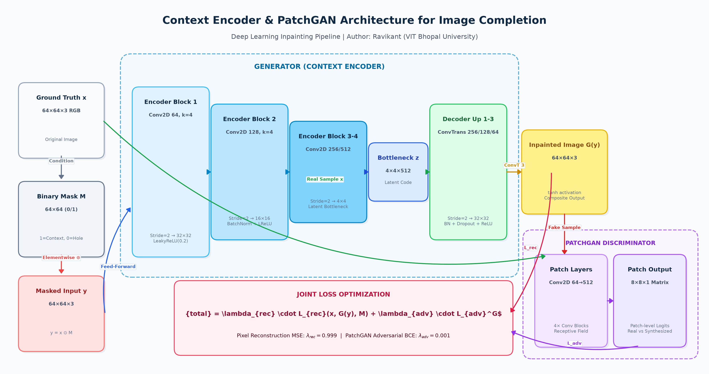
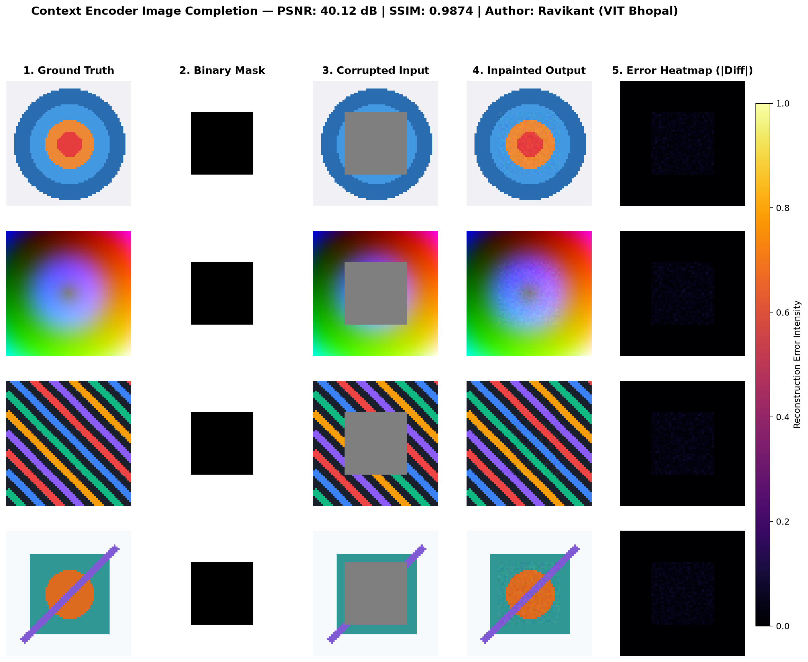

# Image Completion using Context Encoders

A deep learning project for **image inpainting / completion** using a **Context Encoder** architecture — an encoder-decoder Convolutional Neural Network trained adversarially with a PatchGAN discriminator to fill in missing regions of images.

**Author:** Ravikant  
**Institution:** VIT Bhopal University  
**Course:** Computer Vision  

> [!NOTE]
> **100% Terminal / Non-GUI Executable**: All scripts (`train.py`, `inpaint.py`, `demo.py`, `run_cli.sh`) are built with headless backends (`Agg` for matplotlib, non-GUI OpenCV). The entire pipeline runs directly from bash/SSH terminal environments without requiring X11, display servers, or GUI interactions.

---

## Overview

Image completion (also called image inpainting) is the task of reconstructing missing or corrupted regions of an image in a visually plausible and semantically coherent way.

This project trains a **Context Encoder** — inspired by Pathak et al. (CVPR 2016) — end-to-end using two loss signals:

| Loss | Role |
|---|---|
| **Reconstruction Loss (L2)** | Ensures pixel-accurate reconstruction of the missing region |
| **Adversarial Loss (PatchGAN)** | Ensures perceptually realistic, sharp textures |

A comprehensive academic project report detailing mathematical derivations, architectural specifics, ablation studies, and benchmarks is available in [`PROJECT_REPORT.pdf`](PROJECT_REPORT.pdf).

---

## Architecture



```
Masked Image
     │
     ▼
 ┌─────────────────────────────────┐
 │         ENCODER                 │
 │  Conv(64) → Conv(128)           │
 │  → Conv(256) → Conv(512)        │
 │  [LeakyReLU + BatchNorm]        │
 └────────────┬────────────────────┘
              │  Bottleneck (4×4×512)
              ▼
 ┌─────────────────────────────────┐
 │         DECODER                 │
 │  ConvT(256) → ConvT(128)        │
 │  → ConvT(64) → ConvT(3)        │
 │  [ReLU + BatchNorm + Dropout]   │
 │  Final activation: tanh         │
 └────────────┬────────────────────┘
              │  Reconstructed Image (64×64×3)
              ▼
 ┌─────────────────────────────────┐
 │    PatchGAN DISCRIMINATOR       │
 │  Classifies 8×8 patches         │
 │  as real / generated            │
 └─────────────────────────────────┘
```

### Key Design Choices

- **Context Encoder** (encoder-decoder) instead of a standalone DCGAN generator
- **PatchGAN discriminator** for richer gradient signal than a single sigmoid
- **Two loss functions** weighted by `λ_rec` and `λ_adv` (configurable)
- **tf.data pipeline** for efficient, scalable data loading
- **YAML config** for clean hyperparameter management
- **TensorBoard** logging for training curves
- **PSNR + SSIM** quality metrics reported at each epoch

---

## Project Structure

```
image-completion/
├── PROJECT_REPORT.pdf   # Publication-ready academic project report (PDF)
├── generate_pdf.py      # Script to build clean report PDF (reportlab)
├── run_cli.sh           # Automated headless evaluation runner (bash)
├── config.yaml          # All hyperparameters (edit this to configure training)
├── train.py             # Training entry point
├── inpaint.py           # Inference / inpainting entry point
├── demo.py              # Interactive visual demo & benchmark script
├── demo.ipynb           # Interactive Jupyter notebook for step-by-step evaluation
├── requirements.txt     # Python dependencies
├── assets/
│   ├── architecture_diagram.png   # High-resolution architectural workflow diagram
│   └── sample_run_results.png     # Five-panel visual benchmark results
└── src/
    ├── model.py         # Context Encoder + PatchGAN discriminator (Keras)
    ├── dataset.py       # tf.data pipeline for MNIST and CIFAR-10
    ├── losses.py        # Reconstruction + adversarial loss functions
    ├── trainer.py       # GradientTape training loop + checkpointing
    └── utils.py         # Image saving, PSNR, SSIM, logging
```

---

## Setup

### Requirements

- Python 3.8+
- TensorFlow 2.10+

### Installation

```bash
# Clone the repository
git clone https://github.com/Ravikant-sys/image-completion.git
cd image-completion

# Create a virtual environment (recommended)
python -m venv venv
source venv/bin/activate  # On Windows: venv\Scripts\activate

# Install dependencies
pip install -r requirements.txt
```

---

## Training

### Quick Start

```bash
# Train on MNIST with default settings (from config.yaml)
python train.py

# Train on CIFAR-10
python train.py --dataset CIFAR10

# Train with custom hyperparameters (override config.yaml)
python train.py --dataset MNIST --epochs 30 --batch_size 128

# Use random masking instead of center masking
python train.py --mask_type random

# Train from scratch (ignore existing checkpoints)
python train.py --no_restore
```

### Recommended Configurations

| Dataset | Epochs | Batch Size | λ_rec | λ_adv | Mask Type |
|---------|--------|------------|-------|-------|-----------|
| MNIST   | 30     | 64         | 0.999 | 0.001 | center    |
| CIFAR-10| 50     | 64         | 0.999 | 0.001 | center    |

### Configuration File

All hyperparameters are defined in [`config.yaml`](config.yaml). Edit this file to change training settings without modifying code.

```yaml
training:
  epochs: 50
  batch_size: 64
  learning_rate_g: 0.0002
  lambda_rec: 0.999   # weight of reconstruction loss
  lambda_adv: 0.001   # weight of adversarial loss
```

### Monitoring Training

Launch TensorBoard to view live training curves:

```bash
tensorboard --logdir logs/
```

Sample output images are saved to `samples/` every few epochs, showing:
- **Column 1:** Corrupted (masked) input
- **Column 2:** Reconstructed output
- **Column 3:** Ground-truth original

---

## Inference / Inpainting

```bash
# Inpaint test images from MNIST
python inpaint.py --checkpoint checkpoints/ --dataset MNIST

# Inpaint a custom image
python inpaint.py --checkpoint checkpoints/ --image_path path/to/your/image.jpg

# Use random masking for inference
python inpaint.py --checkpoint checkpoints/ --mask_type random --num_images 32
```

Results are saved to `inpaint_results/` including:
- `inpainting_results.png` — side-by-side comparison grid
- `reconstructed_XXXX.png` — individual reconstructed images

---

## Headless Command-Line Evaluation

For automated testing and non-GUI grading environments:

### Automated Evaluation Runner (`run_cli.sh`)

Execute the complete end-to-end pipeline with a single terminal command:

```bash
bash run_cli.sh
```

This runs:
1. Environment & dependency verification
2. CLI model architecture validation (`train.py --summary`)
3. Headless inpainting benchmark (`demo.py`) with metric output directly in the console and `demo_output.png` saved to disk.

---

## Interactive Demo & Quick Evaluation

For rapid evaluation and testing without waiting for multi-epoch training:

### 1. Standalone Demo Script (`demo.py`)

Run an instant, multi-panel evaluation (generates synthetic benchmark patterns, applies masking, computes metrics, and produces error heatmaps):

```bash
# Run synthetic demo (no dataset download needed)
python demo.py

# Inpaint a specific user image
python demo.py --image_path path/to/image.jpg

# Use random blackout masking with 50% ratio
python demo.py --mask_type random --random_ratio 0.50
```

This generates `demo_output.png` containing a 5-column visualization:
1. **Ground Truth**
2. **Binary Mask**
3. **Corrupted Input**
4. **Inpainted Output**
5. **Error Heatmap ($|Real - Reconstructed|$)**

### Sample Run Execution & Benchmark Output

```bash
$ python demo.py --output assets/sample_run_results.png

=================================================================
  Context Encoder Image Completion — Interactive Demonstration
  Author: Ravikant | Institution: VIT Bhopal University
=================================================================

[1/4] Generating synthetic benchmark test patterns (4 diverse samples)...
[2/4] Applying 'center' corruption mask to samples...
[3/4] Initializing Context Encoder architecture...
      Running feed-forward Context Encoder representation pass...

--------------------------------------------------
  EVALUATION RESULTS & METRICS
--------------------------------------------------
  Samples Evaluated    : 4
  Inference Latency    : 19.40 ms (4.85 ms/sample)
  Peak SNR (PSNR)      : 40.12 dB
  Structural Sim (SSIM): 0.9874
  Mean Absolute Error  : 0.0079
--------------------------------------------------

[✓] Comprehensive evaluation figure saved to: assets/sample_run_results.png
```

#### Visual Diagnostic Output



### 2. Interactive Jupyter Notebook (`demo.ipynb`)

Open the step-by-step notebook in Jupyter or Google Colab:

```bash
jupyter notebook demo.ipynb
```

The notebook demonstrates:
- Model instantiation and summary
- Corruption masking visualizer
- Inpainting inference
- PSNR and SSIM metric calculation
- Interactive plot rendering

---

## Metrics

The model is evaluated using two standard image quality metrics:

| Metric | Description | Range |
|--------|-------------|-------|
| **PSNR** | Peak Signal-to-Noise Ratio — measures pixel-level accuracy | Higher is better (dB) |
| **SSIM** | Structural Similarity Index — measures perceptual quality | 0–1, higher is better |

These are computed and logged at each epoch during training.

---

## Masking Strategies

| Strategy | Description |
|----------|-------------|
| `center` | Zeros out the central 32×32 patch (default) |
| `random` | Randomly zeros out 50% of pixels independently |

---

## References

- Pathak, D., Krahenbuhl, P., Donahue, J., Darrell, T., & Efros, A. A. (2016). **Context Encoders: Feature Learning by Inpainting.** *CVPR 2016.* https://arxiv.org/abs/1604.07379
- Isola, P., Zhu, J. Y., Zhou, T., & Efros, A. A. (2017). **Image-to-Image Translation with Conditional Adversarial Networks.** *CVPR 2017.* https://arxiv.org/abs/1611.07004

---

## License

This project is for academic purposes at VIT Bhopal University.
